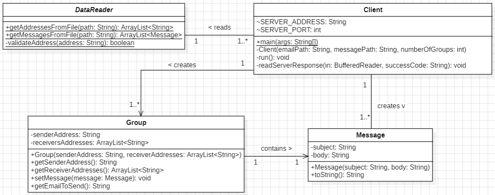
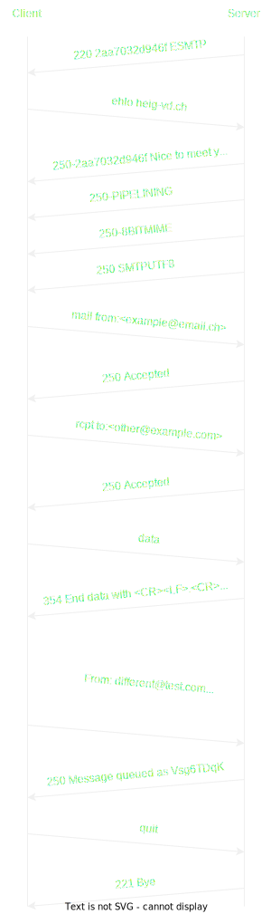

# DAI - Labo SMTP

## Description

This project is a Java application that allows the user to send emails to a list of victims. At the start of the
program, The user must provide a list of email addresses, a list of messages to be sent and the number of groups to be
created. The application will then create groups of victims and send them a message.

## Prerequisites

- Java 21
- Maven 3.9.4
- Docker 24.0.6

## Installation

1. Pull the docker image for the mock SMTP server

    ```shell
    docker pull maildev/maildev
    ```

2. Clone the repository

    ```shell
    git clone https://github.com/Calum-Quinn/dai-lab-smtp
    ```

3. In the `Client.java` file, change the `SERVER_ADDRESS` and `SERVER_PORT` to match your mock SMTP server.

    ```java
    final String SERVER_ADDRESS = "<your server address>";
    final int SERVER_PORT = <your server port>;
    ```

4. Build the project
    ```shell
    mvn package
    ```

## Configuration

At the start of the application, the user must provide two files, the list of email addresses and the list of messages.
You can either use the provided files in the [data](./data) folder or create your own. If you create your own files,
make sure to use
**json** files and follow the format below.

### Email addresses

```json
{
  "addresses": [
    {
      "address": "<email address>"
    },
    {
      "address": "<email address>"
    }
    ...
  ]
}
```

### Messages

```json
{
  "messages": [
    {
      "subject": "<subject>",
      "body": "<body>"
    },
    {
      "subject": "<subject>",
      "body": "<body>"
    }
    ...
  ]
}
```

## Running the application

1. Start the mock SMTP server

    ```shell
    docker run -d -p 1080:1080 -p 1025:1025 maildev/maildev
    ```

2. Run the application

    ```shell
    java -jar target/stmp-client-1.0.jar <path to email addresses> <path to messages> <number of groups>
    ```
   for example :
    ```shell
    java -jar target/stmp-client-1.0.jar data/addresses.json data/messages.json 3
    ```

That's it, the application will now send the messages to the victims.

## Implementation

### Class diagram



#### DataReader

The `DataReader` class is responsible for reading the email addresses and messages from the json files provided by the
user.

#### Client

The `Client` class is the main class of the application. It is responsible for creating the groups of victims and
sending the messages to the SMTP server.

#### Group

The `Group` class represents a group of victims. It contains the sender and the receivers of the group. It also contains 
the message that will be sent to the receivers.

#### Message

The `Message` class represents an email message. It contains the subject and the body of the message.

### Examples of dialogues with the SMTP server
  
#### Basic dialog

